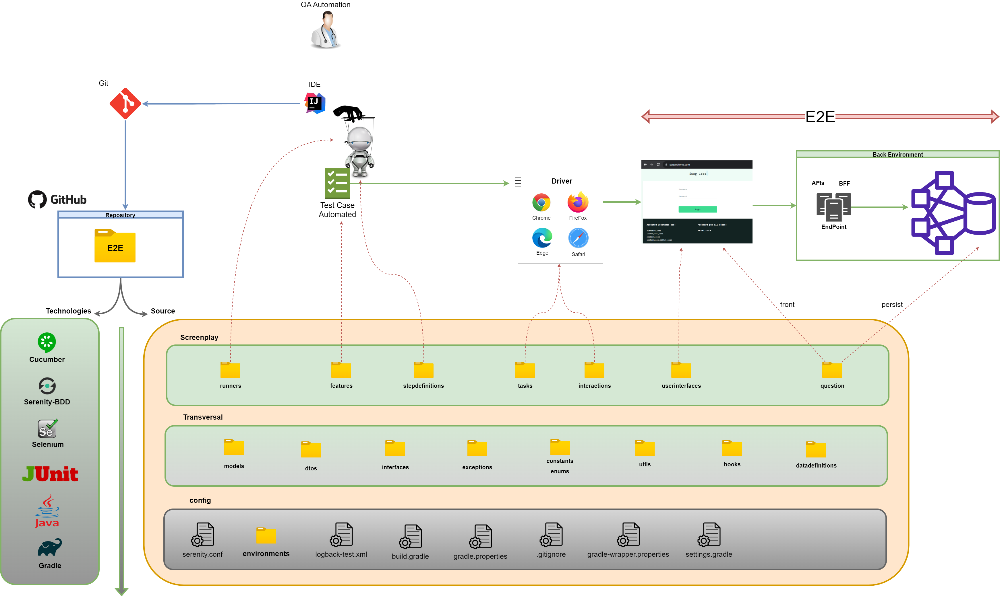

# 🦾 Automatización de Pruebas E2E - Saucedemo 🦾

Este proyecto de automatizacion web hecho en Java-Gradle con Serenity-BDD y Screenplay-pattern, 
refleja los scripts de pruebas automatizacion sobre diferentes funcionalidades/flujos disponibles en la web www.saucedemo.com

<br>

<div id='menu'/>

## 📚 Tabla de contenido: 
1. [Arquitectura](#arquitectura)
   1. [Diagrama Conceptual](#arquitectura_diagrama_conceptual)
   2. [Patron de Diseño](#patron_diseno)
   3. [Estructura de Proyecto](#arquitectura_estructura_proyecto)
2. [Tecnologias / Herramientas](#tecnologias_herramientas)
3. [Pre-requisitos](#pre_requisitos) 
4. [Instalación](#instalacion) 
5. [Ejecución](#ejecucion) 
6. [Informe](#informe)
7. [Ambiente](#ambientes)
8. [Autores](#autores) 

<br>

<div id='arquitectura'/>

##  📐 Arquitectura [📚](#menu)

<br>

<div id='arquitectura_diagrama_conceptual'/>

### Diagrama Conceptual [📚](#menu) 


[Generado en draw.io](https://app.diagrams.net/): ../diagrams/readme/diagrama_conceptual_arquitectura.drawio

<br>

<div id='patron_diseno'/>

### Patron de Diseño [📚](#menu)
**Screenplay**


>"Screenplay es un patrón de diseño de automatización de prueba moderno que 
pretende facilitar la escritura de código de prueba escalable y mantenible 
(segun los principios SOLID)
> > En Screenplay modelamos actores que interactúan con una aplicación de varias maneras 
para realizar tareas que les ayuden a lograr sus objetivos. Los actores tienen 
habilidades , como la capacidad de interactuar con un navegador web o consultar una 
base de datos, que los ayudan a realizar estas tareas. Los actores también pueden 
responder preguntas sobre el estado del sistema, de modo que podamos verificar si 
una función se está comportando de la manera que esperamos"

Para mas información, visite:
<br>https://serenity-bdd.github.io/docs/screenplay/screenplay_fundamentals
<br>

<div id='arquitectura_estructura_proyecto'/>

## 📂 Estructura de Proyecto [📚](#menu) 

### 📁 features: [./src/test/resources/.../]
>Los escenarios y sus casos de prueba en lenguaje Gherkin (Dado-Cuando-Entonces), con narrativa declarativa en términos de negocio.
### 📁 runners: [./src/test/java/.../]
>Clases que permiten ejecutar las pruebas (lanzadores)
### 📁 setups: [./src/test/java/.../]
>Clases de preparacion y configuracion que se activan al inicio, durante y finalizando un caso de prueba (ideal para Hooks)
### 📁 stepdefinitions: [./src/test/java/.../]
>Clases que traducen tecnicamente los escenarios de los features, orquestando y delegando los pasos necesarios que satisfacen los enunciados Gherkin, a traves de tareas (tasks) o preguntas (questions).
### 📁 tasks: [./src/main/java/.../]
>Clases que describen las actividades que el actor realizara sobre el sistema al interpretar un caso de prueba.
### 📁 questions: [./src/main/java/.../]
>Clases que evaluaran el comportamiento debido o esperado, posterior a las actividades de un actor en un caso de prueba,a traves de validaciones y/o verificaciones
### 📁 userinterfaces: [./src/main/java/.../]
>Clases que representan la vista de usuario (pantalla/formulario), que contienen los elementos con los que interactuara directa o indirectamente el actor durante el caso de prueba.
### 📁 interactions: [./src/main/java/.../]
>Clases que contienen las actividades o conjunto de acciones, de bajo nivel que requiere el actor para interactuar con el sistema.
### 📁 models: [./src/main/java/.../]
>Contiene la representación de los objetos de negocio identificados y sus caracteristicas.
### 📁 utils: [./src/main/java/.../]
>Funciones transversales y utilitarias al proceso o logica de negocio que se despliega en la ejecucion/implementacion de un caso de prueba.
### 📁 constants: [./src/main/java/.../]
>Contiene un conjunto de constantes agrupadas y organizadas con base a su comportamiento/proposito.

<br>

<div id='tecnologias_herramientas'/>

## 🛠️ Tecnologias / Herramientas [📚](#menu) 

| Proposito                  | Tecnologias | Herramientas      |
|----------------------------|-------------|-------------------|
| BDD                        | Cucumber    | Gherkin           |      
| Pruebas Automatizadas      | Selenium    | Serenity-BDD      |
| Interprete Automatizacion  | Driver      | chrome-driver     |
| Pruebas                    | JUnit       |                   |
| Lenguaje de programación   | Java        | JDK/JRE           |
| Gestor de dependencias     | Maven       | Gradle            |
| Versionamiento             | Git         | GitHub, GUI/Bash  |
| Calidad de codigo          | Sonar       | SonarLint         |
| IDE                        |             | IntelliJ IDEA     |
| Localizadores              | DOM, xpath, css selectors | dev tools browser |


<br>

<div id='pre_requisitos'/>

## 📋 Pre requisitos - local [📚](#menu) 

1. Java 11 (JDK)
2. IDE IntelliJ IDEA
   1. Con plugins:
      * Cucumber for Java
      * Gherkin 
      * HOCON 
      * SonarLint 
3. Git (GUI/Bash)


<br>

<div id='instalacion'/>

## 📦 Instalación [📚](#menu)

```
1. Clonar/descargar proyecto
    Via HTTPS:
        git clone https://github.com/hcuenca8/test-aut-e2e-saucedemo.git
    Via SSH:
        git clone git@github.com:hcuenca8/test-aut-e2e-saucedemo.git

2. Abrir proyecto en IDE (IntelliJ o de su preferencia)

3. Gestionar dependencias con gradle
    - Limpiar (clean task)
    - Recargar (reload all gradle project)
```

<br>

<div id='ejecucion'/>

### 🤺 **Ejecución** [📚](#menu) 
> Para ejecutar las pruebas automatizadas, dirijase a la seccion de runners en el proyecto, elija el runner que mas se 
> ajuste a su necesidad 
* src/test/java/.../runners
  * /features: encuentre aqui, lanzadores dedicados por funcionalidad 
  * /general: encuentre aqui, lanzadores generales, que representan un grupo de test de interes, como por ejemplo: Regresion

**Desde shell / terminal dentro del proyecto**
* **De todos los test**
```
./gradlew clean test --tests "com.saucedemo.test.automation.e2e.runners.general.TestTodosRunner"
```

* **De un test particular**
```
./gradlew clean test --tests "com.saucedemo.test.automation.e2e.runners.features.cuenta.acceso.TestAccesoRunner"
```
```
./gradlew clean test --tests "com.saucedemo.test.automation.e2e.runners.features.catalogo.producto.TestCatalogoProductoRunner"
```
```
./gradlew clean test --tests "com.saucedemo.test.automation.e2e.runners.features.compra.carrito.TestCarritoCompraRunner"
```
```
./gradlew clean test --tests "com.saucedemo.test.automation.e2e.runners.features.compra.comprador.TestDatosCompradorRunner"
```
**Aqui, el runner mas completo, y que solicita el ejercicio:**
```
./gradlew clean test --tests "com.saucedemo.test.automation.e2e.runners.features.compra.pago.TestPagoCompraRunner"
```

* **De un grupo de test**
``` 
./gradlew clean test --tests "com.saucedemo.test.automation.e2e.runners.general.TestRegresionRunner"
```
``` 
./gradlew clean test --tests "com.saucedemo.test.automation.e2e.runners.general.TestHPRunner"
```
``` 
./gradlew clean test --tests "com.saucedemo.test.automation.e2e.runners.general.TestAPRunner"
```
``` 
./gradlew clean test --tests "com.saucedemo.test.automation.e2e.runners.general.TestSmokeRunner"
```

**Desde IDE**
* **De todos los test**
```
TestTodosRunner
```
* **De un test particular**
```
TestAccesoRunner
```
```
TestCatalogoProductoRunner
```
```
TestCarritoCompraRunner
```
```
TestDatosCompradorRunner
```
**Aqui, el runner mas completo, y que solicita el ejercicio:**
```
TestPagoCompraRunner
```

* **De un grupo de test estandar**
```
TestRegresionRunner
```
```
TestAPRunner
```
```
TestHPRunner
```
```
TestSmokeRunner
```

<br>

<div id='informe'/>

### 📋 **Informe** [📚](#menu)

>Despues de terminar una ejecución de pruebas, puede consultar el informe completo en:
/target/site/serenity/index.html 
> > abriendo el archivo desde su navegador de preferencia

<br>

<div id='ambientes'/>

## 📬 Ambientes [📚](#menu) 
	
* Publico
    + Ambiente de prueba
      + 📦 https://www.saucedemo.com/

<br>

<div id='autores'/>

##  ✍️️ Autores [📚](#menu)️ 
**QC Automation / Analyst**
  * 👨🏻‍💻 hcuenca8@gmail.com

<br>

<!--- comentarios
Visor readme online
    https://stackedit.io/app#
urls emojis icons & symbols
    https://emojikeyboard.org/
    https://www.piliapp.com/emoji/list/?skin=1f3fc

Icons para uso 
    🚧 TODO

Markdown
    Tabla de contenido:
        1. [Example](#id)

    Lista desplegable
        + 
